# SquareLine Studio OBP (Open Board Platform)


---
<p align="center">
  <span style="color: yellow;">If you like this, consider supporting it:</span>
</p>

<p align="center">
  <a href="https://www.buymeacoffee.com/nishad2m8" target="_blank">
    
  </a>
  <a href="https://www.youtube.com/channel/UCV_35rUyf4N5mHZXaxaFKiQ" target="_blank">
    
  </a>
</p>

---
The OBP feature allows you to add custom boards to SquareLine Studio. The board packages need to be copied to the boards folder of SquareLine Studio. The added boards will be displayed on the Launcher screen in the Create menu.

https://docs.squareline.io/docs/obp/ 

The board package files should be copied to the following path:

- Windows: ```C:\Users\USERNAME\Documents\SquareLine\boards```
- Linux: ```~/SquareLine/boards```
- MacOS: ```Users\USERNAME\SquareLine\boards```

---

# Supported boards

_Support by using the referral link below to purchase the board 🛍️ !_

| Board 🛍️ | Image | Resolution / Size | Flash / PSRAM | My Projects |
|-----------------|-----------------|-----------------|-----------------| ------- |
|💥 WaveShare |
|[ESP32-C6 1.47"](https://s.click.aliexpress.com/e/_okYMjVj)|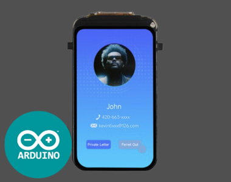 | 172×320 / 1.47"| 4MB Flash / No PSRAM| https://youtu.be/pDeoPXndeUQ |
|[ESP32-S3 1.85"]( https://www.waveshare.com/esp32-s3-touch-lcd-1.85.htm?&aff_id=104576)| 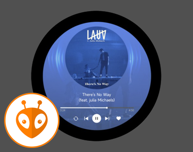 | 360x360 / 1.85" | 16MB Flash / 8MB PSRAM | 🚧 |
|[ESP32-S3 1.3"](https://www.waveshare.com/esp32-s3-lcd-1.3.htm?&aff_id=104576)|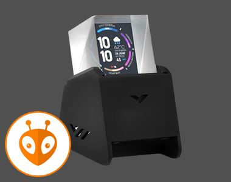 |240x240 / 1.3" | 16MB Flash / 8MB PSRAM | https://github.com/nishad2m8/WS-1.3|
|[ESP32-S3 1.85C"](https://s.click.aliexpress.com/e/_on41Aqd)|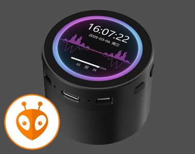 | 360x360 / 1.85"| 16MB Flash / 8MB PSRAM | https://github.com/nishad2m8/WS-1.85C|
|[ESP32-S3 AMOLED 2.41"](https://s.click.aliexpress.com/e/_on41Aqd)|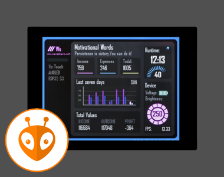| 450x600 / 2.41" | 16MB Flash / 8MB PSRAM | https://github.com/nishad2m8/WS-2.41|
|💥 Lilygo|
| [T-Display S3](https://s.click.aliexpress.com/e/_EyapYZJ)  | 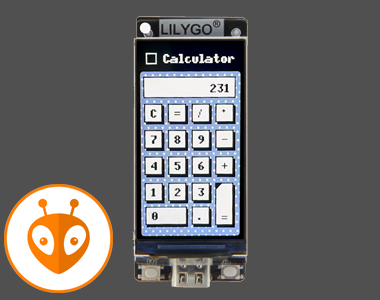 | 320x170 / 1.9"  | 16MB Flash / 8MB PSRAM | https://github.com/nishad2m8/T-Display-S3-YT |
| [T-Display S3 AMOLED](https://s.click.aliexpress.com/e/_EJvcv3n)  | 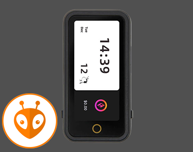 | 536x240 / 1.91" | 16MB Flash / 8MB PSRAM  | https://github.com/nishad2m8/BTC-Ticker |
| [T-Display S3 AMOLED 1.43](https://s.click.aliexpress.com/e/_oo8DcLv)  |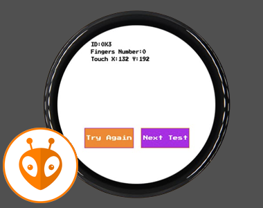 | 466x466 / 1.43" | 16MB Flash / 8MB PSRAM | https://github.com/nishad2m8/T-Display-S3-DS-1.43-YT |
| [T-Display S3 AMOLED 1.64](https://s.click.aliexpress.com/e/_oFH1351)  |  | 280x456 / 1.64"  | 16MB Flash / 8MB PSRAM | |
| [T-Display S3 Pro](https://s.click.aliexpress.com/e/_onH08Ub)  | 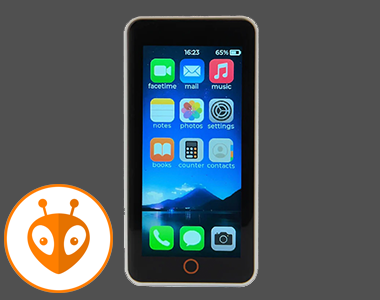 | 222x480 / 2.33"  | 16MB Flash / 8MB PSRAM | https://github.com/nishad2m8/T-Display-S3-Pro-YT |
| [T-Encoder Pro](https://s.click.aliexpress.com/e/_mOAGaVW)  | 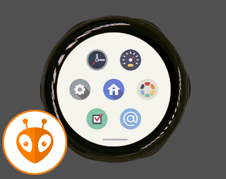 | 390x390 / 1.2"  | 16MB Flash / 8MB PSRAM | |
| [T-QT C6](https://s.click.aliexpress.com/e/_DEoEopt)  | 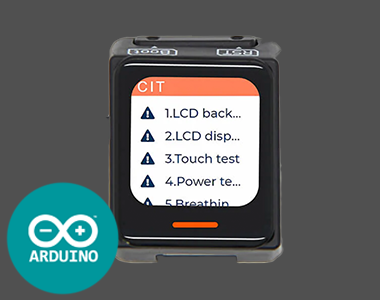 | 128x128 / 0.85"  | 4MB Flash / No PSRAM | https://github.com/nishad2m8/T-QT-C6-YT |
| [T-RGB](https://s.click.aliexpress.com/e/_oDt7iPZ)  | 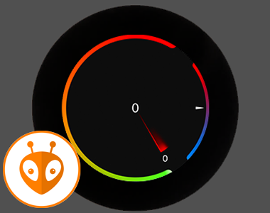 | 480x480 / 2.8" | 6MB Flash / 8MB PSRAM | https://github.com/nishad2m8/T-RGB-YT |
| [T4-S3](https://s.click.aliexpress.com/e/_EwYC7m9)  | 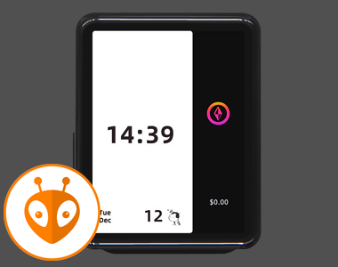 | 450x600 / 2.41"  | 16MB Flash / 8MB PSRAM | https://github.com/nishad2m8/T4-S3-YT |
|💥 M5Stack |
|[Cardputer](https://s.click.aliexpress.com/e/_DnK2GNR)|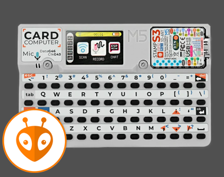 | 240x135 / 1.14" | 8MB Flash / No PSRAM | https://github.com/nishad2m8/GeminiPuter |
|💥 Makerfabs |
|[Rotary IPS-Display 1.28"](https://www.makerfabs.com/matouch-esp32-s3-rotaryips-display1-28-gc9a01.html)|  | 240x240 / 1.28" | 16MB Flash / 8MB PSRAM | https://github.com/nishad2m8/MaTouch-YT |
|💥 CYD|
|[ESP32-4848S040C-IY3](https://s.click.aliexpress.com/e/_EQ3RBgD)|  | 480x480 / 4" | 16MB Flash / 8MB PSRAM | https://github.com/nishad2m8/Display-Panel-CYD |
|[ESP32-2432S028R](https://s.click.aliexpress.com/e/_Ddtuvi1)|  | 320x240 / 2.8" | 4MB Flash / No PSRAM |🚧|


---

# Instruction

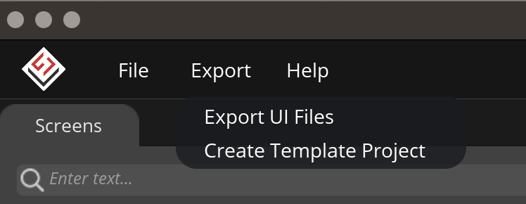
---

## PlatformIO

After exporting, rename the folder and files to match the following structure.


```

├── Template                              ├── Template
│   └── SLS-OBP-Your-Project              |   └── SLS-OBP-Your-Project
│       ├── libraries                 ➔   │       ├── lib
│       │   └──                           │       │   └── 
│       ├── platformio.ini                │       ├── platformio.ini
│       └── ui                        ➔   │       └── src
│           └── ui.ino                ➔   │           └── main.cpp
```
---

## Arduino
After exporting, update the Arduino settings → set the Sketchbook location to the →  SLS-OBP-Your-Project folder.

```plaintext
├── Template  
│   └── SLS-OBP-Your-Project   
│       ├── libraries             
│       │   └──                          
│       └── ui                        
│           └── ui.ino
```

