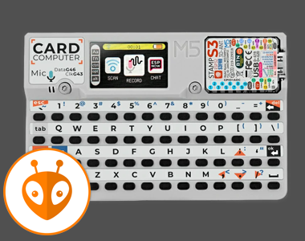
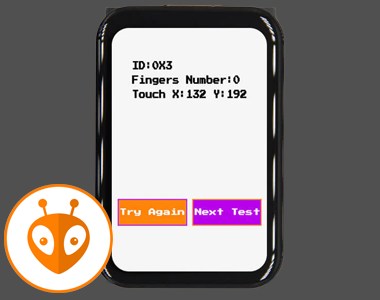
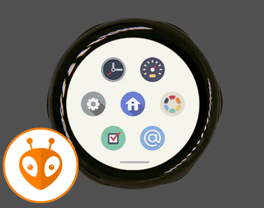
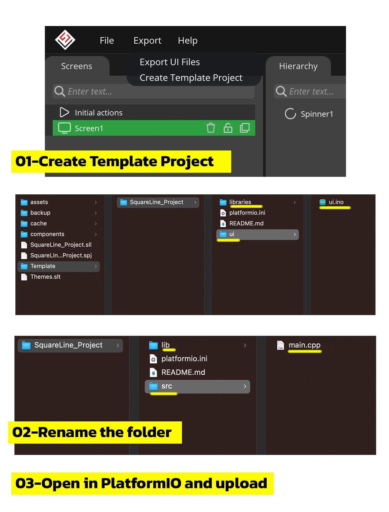
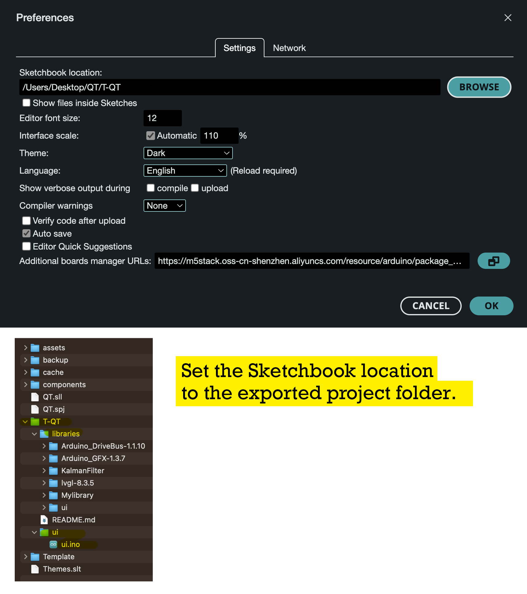

# SquareLine Studio OBP (Open Board Platform)


---
<p align="center">
  <span style="color: yellow;">If you like this, consider supporting it:</span>
</p>

<p align="center">
  <a href="https://www.buymeacoffee.com/nishad2m8" target="_blank">
    
  </a>
  <a href="https://www.youtube.com/channel/UCV_35rUyf4N5mHZXaxaFKiQ" target="_blank">
    
  </a>
</p>

---
The OBP feature allows you to add custom boards to SquareLine Studio. The board packages need to be copied to the boards folder of SquareLine Studio. The added boards will be displayed on the Launcher screen in the Create menu.

https://docs.squareline.io/docs/obp/ 

The board package files should be copied to the following path:

- Windows: ```C:\Users\USERNAME\Documents\SquareLine\boards```
- Linux: ```~/SquareLine/boards```
- MacOS: ```Users\USERNAME\SquareLine\boards```

---


# Supported boards

_Support by using the referral link below to purchase the board 🛍️ !_

| Board 🛍️ | Image | Resolution | IDE | Projects |
|-----------------|-----------------|-----------------|--- |--|
|💥 M5Stack |
|[Cardputer](https://s.click.aliexpress.com/e/_DnK2GNR)| |240x135|PlatofmIO| https://github.com/nishad2m8/GeminiPuter <br> https://github.com/nishad2m8/Pip-Boy-Weather-Clock |
|💥 Lilygo|
| [T-Display S3](https://s.click.aliexpress.com/e/_EyapYZJ)  |  | 320x170  | PlatformIO | https://github.com/nishad2m8/T-Display-S3-YT |
| [T-Display S3 AMOLED](https://s.click.aliexpress.com/e/_EJvcv3n)  |  | 536x240  | PlatformIO | https://github.com/nishad2m8/BTC-Ticker |
| [T-Display S3 AMOLED 1.43](https://s.click.aliexpress.com/e/_oo8DcLv)  | | 466x466  | PlatformIO | https://github.com/nishad2m8/T-Display-S3-DS-1.43-YT|
| [T-Display S3 AMOLED 1.64](https://s.click.aliexpress.com/e/_oFH1351)  |  | 280x456  |PlatformIO|https://github.com/nishad2m8/Pip-Boy-Weather-Clock |
| [T-Display S3 Pro](https://s.click.aliexpress.com/e/_onH08Ub)  |  | 222x480  | PlatformIO | https://github.com/nishad2m8/T-Display-S3-Pro-YT|
| [T-Encoder Pro](https://s.click.aliexpress.com/e/_mOAGaVW)  |  | 390x390  | PlatformIO | https://github.com/nishad2m8/T-Encode-Pro-YT |
| [T-QT C6](https://s.click.aliexpress.com/e/_DEoEopt)  |  | 128x128  | Arduino | https://github.com/nishad2m8/T-QT-C6-YT |
| [T-RGB](https://s.click.aliexpress.com/e/_oDt7iPZ)  |  | 480x480  | PlatformIO | https://github.com/nishad2m8/T-RGB-YT |
| [T4-S3](https://s.click.aliexpress.com/e/_EwYC7m9)  |  | 450x600  | PlatformIO |https://github.com/nishad2m8/T4-S3-YT |
|💥 Makerfabs |
|[Rotary IPS-Display 1.28"](https://www.makerfabs.com/matouch-esp32-s3-rotaryips-display1-28-gc9a01.html)|  | 240x240 |PlatformIO | WIP |
|💥 CYD|
|[4848S040C-IY3](https://s.click.aliexpress.com/e/_EQ3RBgD)|  | 480x480 |PlatformIO |https://github.com/nishad2m8/Display-Panel-CYD|


# Instruction : PlatformIO



# Instruction : Arduino


