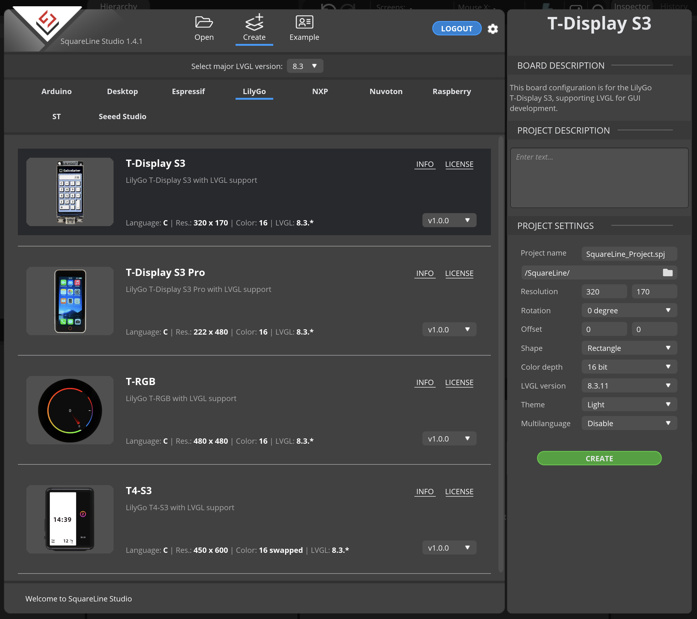
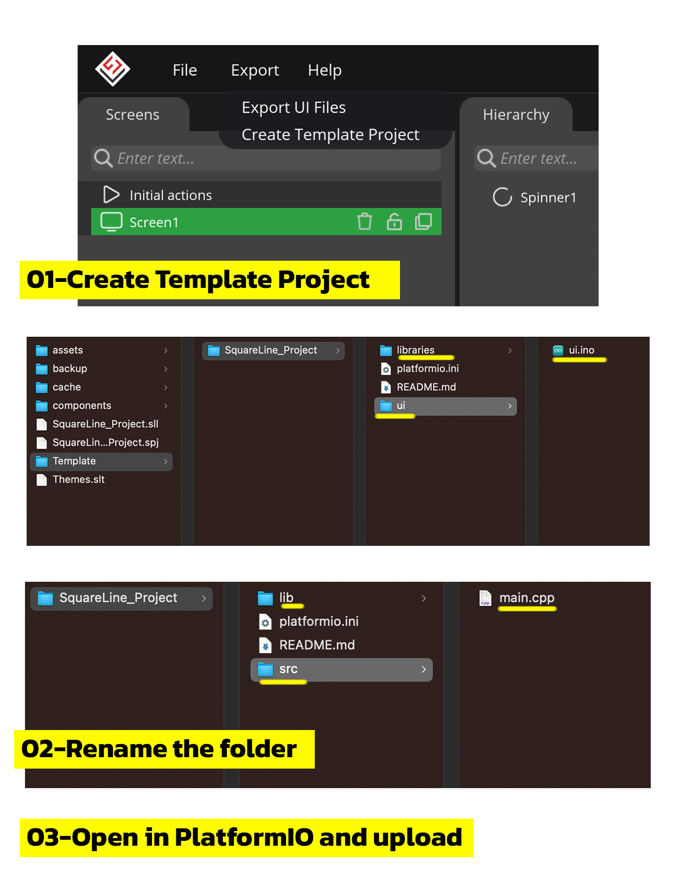

https://www.buymeacoffee.com/nishad2m8
https://www.youtube.com/nishad2m8

---

# SquareLine Studio OBP (Open Board Platform)



https://docs.squareline.io/docs/obp/ 

The board package files should be copied to the following path:

- Windows: ```C:\Users\USERNAME\Documents\SquareLine\boards```
- Linux: ```~/SquareLine/boards```
- MacOS: ```Users\USERNAME\SquareLine\boards```

# Instruction

